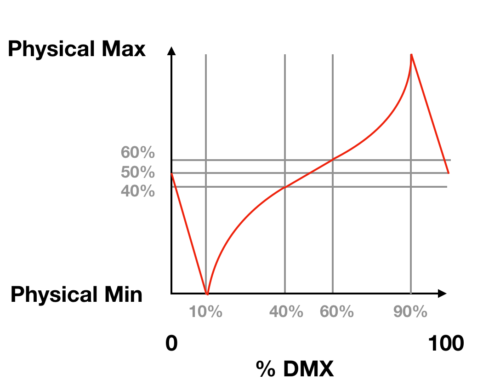

# Physical Attribute Enhancement Proposal

## Linked Issue

This Proposal implements the requirements of:

- TODO

# Problem
- Non linear Physical behavior in relation to DMX Value.

# Solution

## Current

Use Channel Set to interpolate

```
<DMXChannel DMXBreak="1" Default="32/1" Geometry="Head" Highlight="32/1" Offset="37">
<LogicalChannel Attribute="Shutter1" DMXChangeTimeLimit="0.000000" Master="None" MibFade="0.000000" Snap="No">
    <ChannelFunction Attribute="Shutter1Strobe" DMXFrom="64/1" Name="Strobe " OriginalAttribute="" PhysicalFrom="0.300000" PhysicalTo="20.000000" RealFade="0.000000">
        <ChannelSet DMXFrom="64/1" Name="Slow to fast 1/12" PhysicalFrom="1" PhysicalTo="1" WheelSlotIndex="0"/>
        <ChannelSet DMXFrom="67/1" Name="Slow to fast 2/12" PhysicalFrom="6" PhysicalTo="6" WheelSlotIndex="0"/>
        ...
</LogicalChannel>
</DMXChannel>
```


## Proposal 1

| XML Attribute Name | Description                                                                                                                                   |                                                                                                                                  
| ------------------ | -------------------------------------------------------------------------------------------------------------------------------------------- | 
| Linear             | Describes a linear interpolation between defined point and the the next point.                                                               |     
| Spline             | Describes a spline interpolation between defined point and the the next point. The f''(x) at start and end match the neighbor curves.        |         
| SplineBreakStart   | Describes a spline interpolation between defined point and the the next point. The f''(x) at the end match the neighbor curve.               |         
| SplineBreakEnd     | Describes a spline interpolation between defined point and the the next point. The f''(x) at the start match the neighbor curve.             | 
| StepStart          | Describes a jump to the next value and then a constant to the next point.                                                                    |         
| StepEnd            | Describes a constant to the next point and then a jump to the next value.                                                                    |         

TODO: Update this here



```
<DMXProfiles>
    <DmxProfile Name="Fancy">
        <Point DMXPercent="0" Type=""Linear" PhysicalPercent="50">
        <Point DMXPercent="10" Type=""Linear" PhysicalPercent="0">
        <Point DMXPercent="30" Type=""Spline" PhysicalPercent="50">
        <Point DMXPercent="90" Type=""Linear" PhysicalPercent="100">
        <Point DMXPercent="100" Type=""Linear" PhysicalPercent="50">
    </DmxProfile>
</DMXProfiles>

<DMXChannel DMXBreak="1" Default="32/1" Geometry="Head" Highlight="32/1" Offset="37">
<LogicalChannel Attribute="Shutter1" DMXChangeTimeLimit="0.000000" Master="None" MibFade="0.000000" Snap="No">
    <ChannelFunction Attribute="Shutter1Strobe" DMXFrom="64/1" Name="Strobe " OriginalAttribute="" PhysicalFrom="100" PhysicalTo="100" RealFade="0.000000" DMXProfile="Fancy" Min="0" Max="200">
</LogicalChannel>
</DMXChannel>
```
